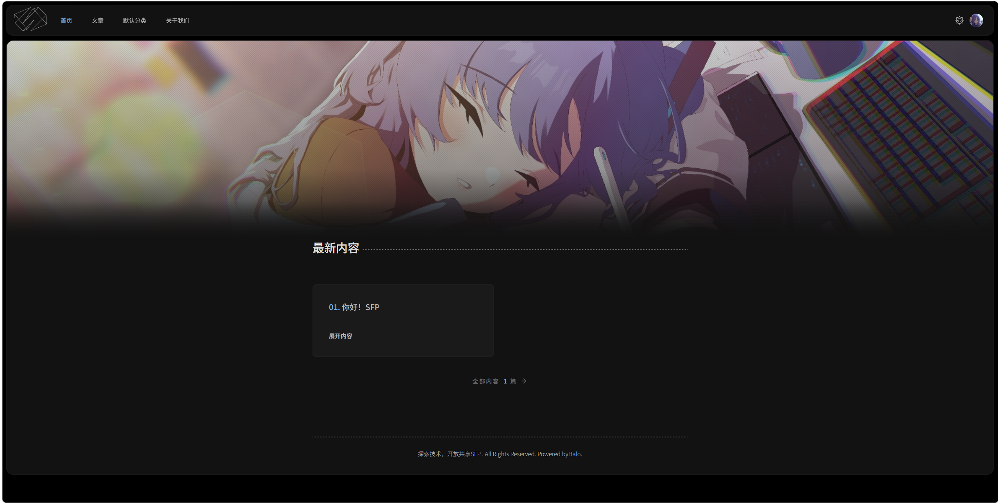
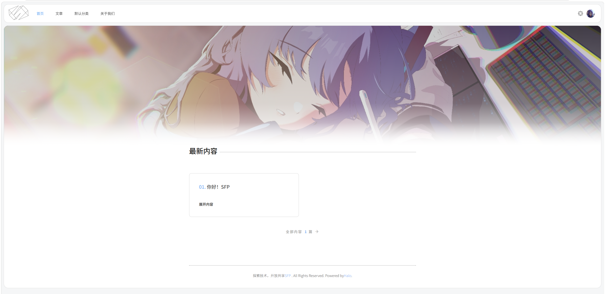

  
  

# Nex - Halo 2.0 亮/暗色杂志风格主题

Nex 是一款为 Halo 2.0 打造的**亮/暗色系杂志风格**主题，从 [JaneLens/EverUs](https://github.com/JaneLens/EverUs)（Typecho 版）和 EverUs 移植并魔改而来。主题以深邃的黑色为基底，搭配绿色点缀，融入页面过渡动画，目前已测试作为SFP工作室官网。

[SFP](https://sfptech.cn)
